# Node-EJS 

Ce projet consiste à créer une application web dynamique affichant une liste d'événements en utilisant EJS comme moteur de rendu dans une application Node.js avec Express.

## Initialisation du projet et test 
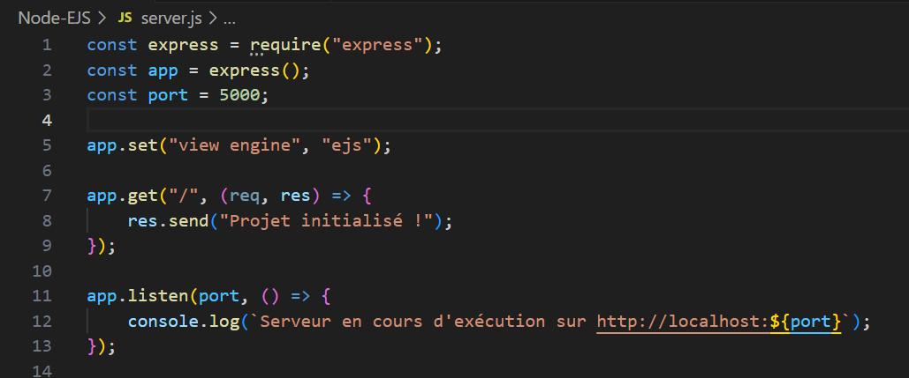
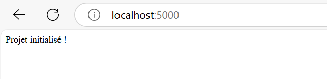

## Modèle de données 
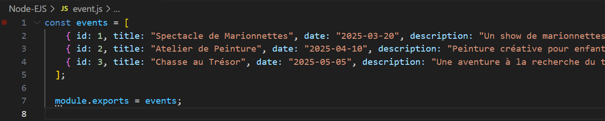

On ajoute un bout de code pour tester le fonctionnement correct de notre module 
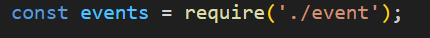
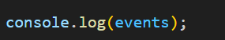
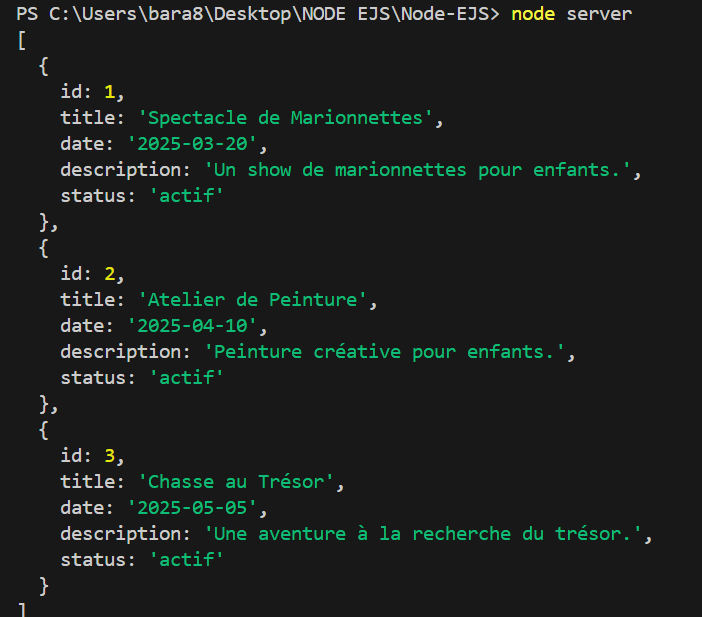

## Structurer les dossiers 
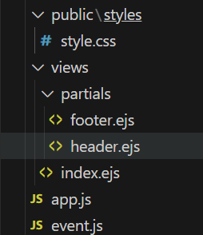

## Header et footer
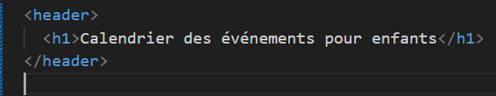
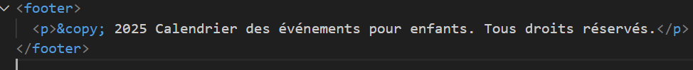

## Création page index , routage et rendu 
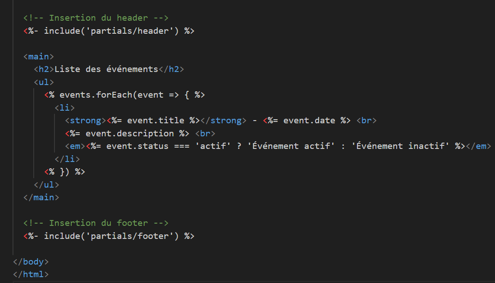
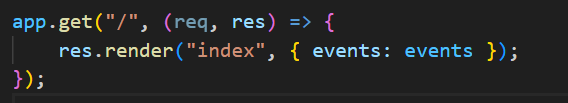
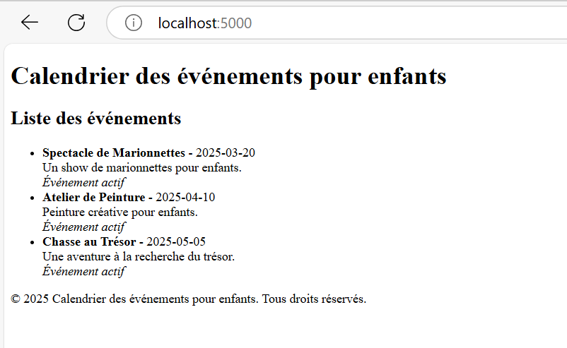

## Ajout de style + Rendu 
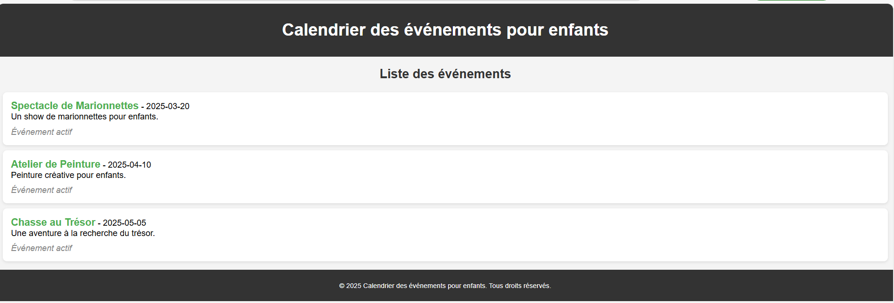
